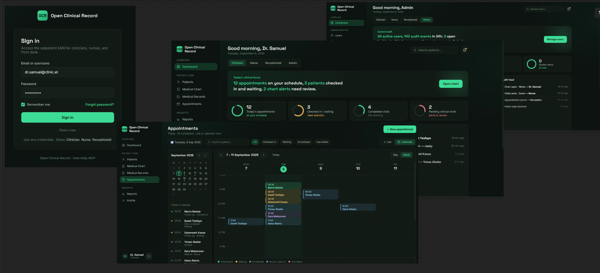

# Open Clinical Record

**Open Clinical Record (OCR)** is a focused outpatient EMR internship project built around three core workflows:

1. **Patient Management**
2. **Patient Chart**
3. **Appointment Management**




The MVP is intentionally limited to functionality that can realistically be implemented, tested, and demonstrated within the remaining one-month internship period.

## Project Direction

The patient is the central record connecting the three MVP areas:

```text
Patient Management
       ↓
Patient Chart
       ↓
Appointment Management
       ↓
Check-in / Visit History
```

The project is not attempting to build a complete hospital EMR during the internship. Additional capabilities may be considered only after the core MVP is working and only if sufficient time remains.

### Application Roles

The MVP uses **four application roles**:

| Role | Identity claim | Primary responsibility |
|------|----------------|------------------------|
| **Receptionist / Front Desk** | `Receptionist` | Registration, appointments, check-in |
| **Nurse / Clinical Staff** | `Nurse` | Chart support, vitals, visit workflow |
| **Clinician / Doctor** | `Doctor` | Chart review and authorized clinical updates |
| **System Administrator** | `Admin` | Users, roles, system configuration |

Authentication, authorization, validation, error handling, and basic audit logging are **cross-cutting mechanisms** (not extra clinical modules). System Administrator is an **application role** because the product includes real user/role administration endpoints and UI.

## MVP Modules

### 1. Patient Management

- Register patients
- Assign unique patient identifiers
- Search patients
- View patient profiles
- Update permitted demographic/contact information
- Maintain basic patient status
- Detect likely duplicate patient records

### 2. Patient Chart

- View patient demographics and status
- Record and view allergies
- Record and view relevant medication/history information
- Record and view important patient alerts where required
- View appointment and visit/check-in history

The chart is the longitudinal patient view. Per-visit clinical detail is organized under visit history / medical records for each attendance.

### 3. Appointment Management

- Create appointments for existing patients
- View appointments
- Reschedule appointments
- Cancel appointments
- Maintain appointment status/history
- Check in patients
- Support a basic walk-in path without fabricating an appointment

## Technology Stack

- **Frontend:** React
- **Backend:** .NET / ASP.NET Core
- **API:** RESTful HTTP API
- **Database:** PostgreSQL
- **ORM / Data Access:** Entity Framework Core + Npgsql

PostgreSQL is the selected and authoritative database engine for the internship MVP.

## Documentation

See the `docs/` directory for scope, SRS, role guide, architecture, clinical visit model, and related material.

## Status

**Aligned baseline:** four application roles, Patient → Visit → Encounter longitudinal model, three core modules. Next work is implementation audit (authorization endpoints, ERD vs EF, chart finish) rather than expanding scope.
